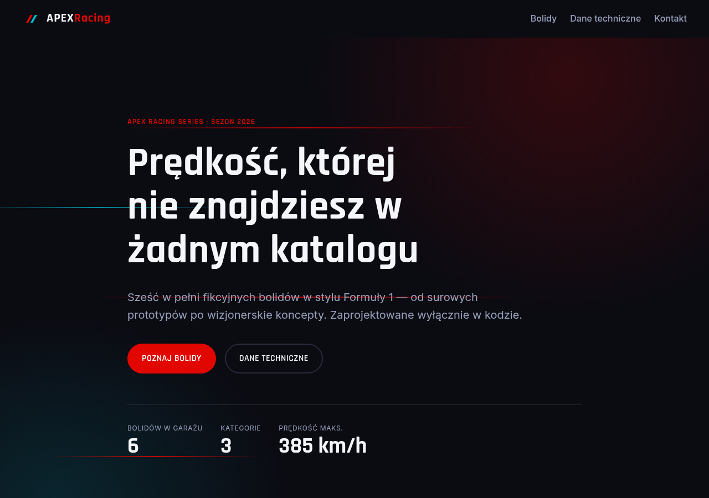
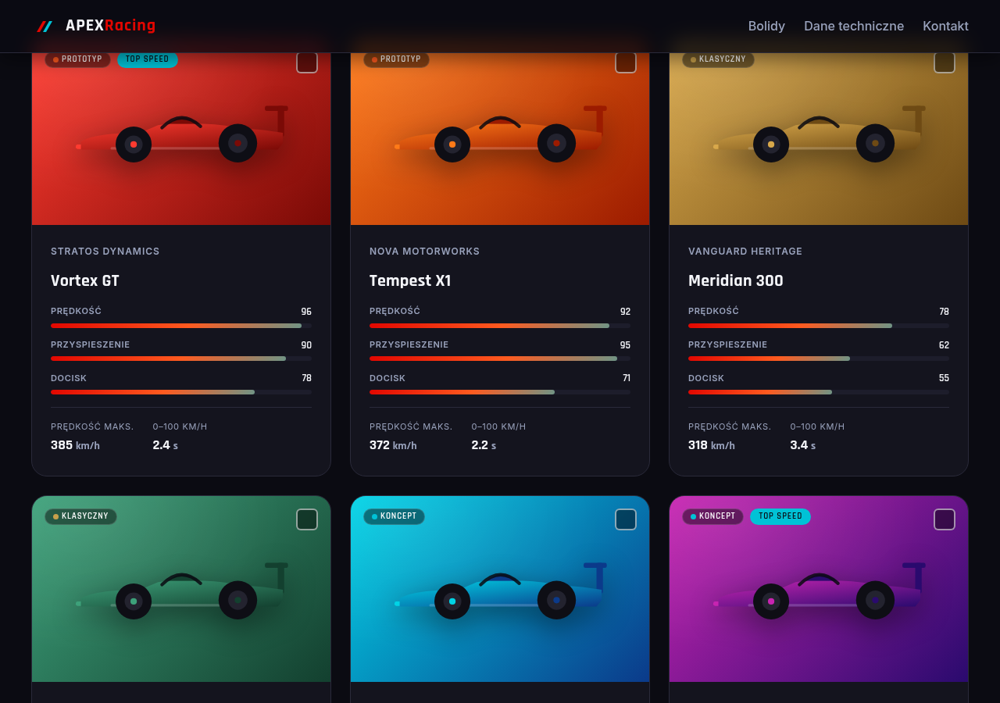
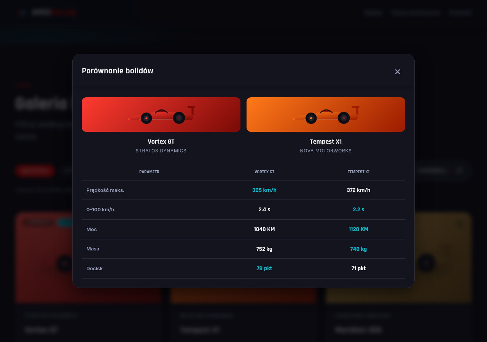

# APEX Racing Series

A static portfolio site presenting six fictional Formula 1‑style concept cars. Built as a
front‑end showcase with an emphasis on **SCSS architecture, code quality, accessibility and
pixel‑perfect detail** — no frameworks, no bundler, zero runtime dependencies.

> ⚠️ **Everything here is fictional.** APEX Racing Series, the teams, the cars and every spec
> are made up for this portfolio project. There are no real brands, logos, drivers or photos —
> each car is drawn from code as an inline SVG built from two brand colours.

🔗 **Live demo:** <https://dolildev.github.io/velocity-grid/>





## Features

- **Full‑screen hero** with a dark theme, brand gradient and subtle CSS speed‑streak animation.
- **Sticky navigation** that fades in a background once scrolled, with a scrollspy that
  highlights the tab of the section currently in view (`aria-current`).
- **Car gallery** (CSS Grid) of six cars, each with a generated SVG silhouette, category badges
  and three **animated spec bars** that fill when the card enters the viewport.
- **Category filtering** (all / prototype / classic / concept) with animated show/hide and a
  screen‑reader result announcement.
- **Comparison tool** — tick two cars and compare their stats side by side in an accessible
  modal dialog (focus trap, `Esc` to close, focus restoration).
- **Sortable, responsive technical‑data table** — click any column header to sort (with
  `aria-sort` exposed to assistive tech).
- **Mobile‑first & accessible:** keyboard navigable, visible focus rings, `prefers-reduced-motion`
  respected, semantic landmarks and a correct heading hierarchy.

## Tech stack

| Layer     | Choice                                                         |
| --------- | -------------------------------------------------------------- |
| Markup    | Semantic HTML5 (landmarks, ARIA where needed)                  |
| Styles    | SCSS compiled with **Dart Sass**, 7‑1 architecture, BEM naming |
| Behaviour | **Vanilla JavaScript** (ES modules, no libraries)              |
| Tooling   | Prettier, Stylelint (standard‑scss), ESLint (flat config)      |
| Build     | A single npm script that compiles SCSS — the rest is static    |

## Project structure

```
.
├── index.html              # Single page, all sections
├── assets/                 # Generated SVGs (favicon, social cover) + screenshots
├── css/
│   └── style.css           # Compiled output of scss/main.scss (committed for the demo)
├── js/
│   ├── data.js             # The single source of truth: car dataset + category labels
│   ├── carArt.js           # Pure function: car → inline SVG silhouette
│   ├── gallery.js          # Renders the cards from data.js
│   ├── specTable.js        # Renders the sortable technical‑data table
│   ├── nav.js              # Sticky‑nav scroll state
│   ├── specBars.js         # IntersectionObserver that fills the spec bars
│   ├── filter.js           # Category filtering + animated transitions
│   ├── compare.js          # Selection state + accessible comparison modal
│   └── main.js             # Entry point: wires modules to the DOM
└── scss/
    ├── abstracts/          # _variables, _functions, _mixins, _index (no CSS output)
    ├── base/               # _reset, _base, _typography
    ├── components/         # _button, _badge, _card, _nav, _spec-bar, _modal
    ├── layout/             # _header, _hero, _grid, _footer
    ├── pages/              # _home (page‑specific composition)
    └── main.scss           # Entry point — @use joins every partial
```

## SCSS Architecture

The styles follow a simplified **7‑1 pattern**: one `main.scss` entry point plus folders of
partials grouped by responsibility (`abstracts`, `base`, `components`, `layout`, `pages`).
Partials are joined with the modern Sass module system — **`@use` / `@forward`, not the
deprecated `@import`**.

### Why `@use` and `@forward`

`@import` dumped everything into one global namespace and re‑evaluated files on every import.
`@use` loads a file **once** and namespaces its members, so tokens can't leak or collide.
`abstracts/_index.scss` then re‑exports the three abstract files with `@forward`, which lets
every partial pull in all design tokens, functions and mixins with a single line:

```scss
@use '../abstracts' as *; // variables + rem() + every mixin, namespaced cleanly
```

`main.scss` deliberately loads layers from generic to specific (abstracts → base → components →
layout → pages) so the cascade is predictable.

### The function: `rem()`

`abstracts/_functions.scss` defines one function that converts px design values to rem:

```scss
@function rem($px) {
  @return math.div($px, $root-font-size) * 1rem; // 24px → 1.5rem
}
```

Authoring in px stays readable (`padding: rem(16px)`), but the output is relative, so the whole
UI scales with the user's browser font‑size. The spacing scale is then derived from a single unit
with SCSS math (e.g. `$space-xl: $space-unit * 4`), which keeps the rhythm proportional and
removes magic numbers.

### The mixins

Five mixins carry the repeated patterns (all genuinely used in components, not decoration):

| Mixin                                 | Job                                                  | Used by (examples)                   |
| ------------------------------------- | ---------------------------------------------------- | ------------------------------------ |
| `respond($breakpoint)`                | Mobile‑first media query from the `$breakpoints` map | `_grid`, `_hero`, `_footer`, `_nav`  |
| `flex-center($direction, $gap)`       | Centre a flex container                              | `_card` (media), `_modal`, `_nav`    |
| `button-variant($bg, $fg, $hover-bg)` | One‑line button colour scheme + hover/focus          | `_button` (`--primary`, `--compare`) |
| `card-hover($lift)`                   | Lift + shadow + border on hover                      | `_card`                              |
| `truncate`                            | Single‑line ellipsis                                 | `_card` (team name)                  |

`respond()` reads a shared breakpoints map and `@error`s on an unknown key:

```scss
@include respond('lg') {
  grid-template-columns: repeat(3, 1fr);
}
```

A shared `$category-colors` map is fanned out into modifier classes with `@each`, so badge dots
and active filter buttons share one colour source.

## JavaScript

Plain ES modules, each with a single responsibility and no shared global state. `data.js` is the
only source of truth; rendering and behaviour read from it. The code uses `const`/`let`, arrow
functions, destructuring, template literals, `dataset`, the IntersectionObserver API and the
`matchMedia` reduced‑motion query.

## Accessibility & performance

- Skip link, semantic landmarks (`header`/`nav`/`main`/`section`/`footer`) and an `h1→h6` order.
- Full keyboard support, a visible `:focus-visible` ring, and a focus‑trapped modal that restores
  focus on close.
- `prefers-reduced-motion` disables animations everywhere — spec bars then appear filled instantly.
- Filter changes are announced through an `aria-live` status region.
- Media carries intrinsic `width`/`height` (no layout shift); fonts are preconnected and the
  critical stylesheet is preloaded; colours meet WCAG AA contrast.

## Technical Decisions

**Vanilla JS instead of a framework.** The site is small and static, so a framework would add a
build step, runtime weight and indirection for no benefit. Native ES modules keep it
dependency‑free and fast, and make the DOM/IntersectionObserver work explicit and easy to defend.

**A 7‑1 SCSS architecture.** Splitting design tokens and tools (`abstracts`) from `base`,
`components`, `layout` and `pages` keeps every file single‑purpose and the cascade predictable.
`@use`/`@forward` give real module scoping, so nothing leaks globally and the styles scale without
specificity wars.

**IntersectionObserver for one‑shot reveals; a throttled scroll handler for the nav.** Filling
the spec bars is a "fire once when visible" job, so a single shared observer is ideal — it reacts
only when a card's visibility changes, fills the bars **once**, then `unobserve`s it (no
`getBoundingClientRect` on every scroll event). The nav behaviours are position‑relative instead:
the sticky background and the scrollspy both need to compare scroll position to a line — and the
scrollspy must still flag the last section when a short footer can't reach a mid‑viewport band —
so they use one `requestAnimationFrame`‑throttled scroll handler each. Right tool per job.

## Development

```bash
# 1. Install dev tooling (Dart Sass + linters)
npm install

# 2. Compile SCSS → css/style.css (minified)
npm run scss

# …or recompile on every change
npm run watch

# Quality checks
npm run lint:scss   # Stylelint on scss/**/*.scss
npm run lint:js     # ESLint on js/
npm run format      # Prettier --write across the project
```

Then open `index.html` in a browser. Because it uses ES modules, serve it over HTTP rather than
`file://` (e.g. `python3 -m http.server`) so the modules load.

## License

MIT — see the `license` field in `package.json`. A fictional portfolio project; all brands,
teams, drivers and cars are invented.
